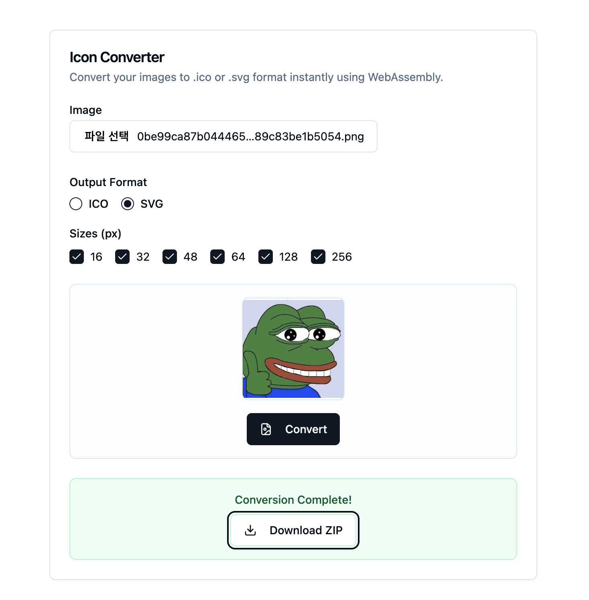

# imgico

Convert images (png, jpg, svg, etc.) to ICO format using ...

- [node](./node/README.md)
  - [npm](https://www.npmjs.com/package/imgico)
- [rust](./rust/README.md)
  - [crate](https://crates.io/crates/imgico)

## example

[imgico: web](https://web.d3fau1t.net/imgico)

> 
